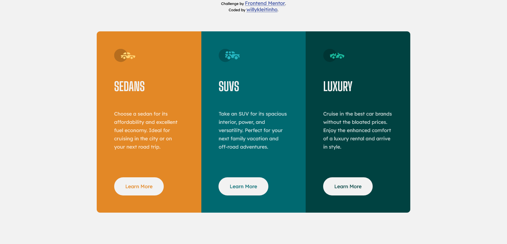

# Frontend Mentor - 3-column preview card component solution

This is a solution to the [3-column preview card component challenge on Frontend Mentor](https://www.frontendmentor.io/challenges/3column-preview-card-component-pH92eAR2-). Frontend Mentor challenges help you improve your coding skills by building realistic projects. 

## Table of contents

- [Overview](#overview)
  - [The challenge](#the-challenge)
  - [Screenshot](#screenshot)
  - [Links](#links)
- [My process](#my-process)
  - [Built with](#built-with)
  - [What I learned](#what-i-learned)
  - [Continued development](#continued-development)
  - [Useful resources](#useful-resources)
- [Author](#author)

## Overview

### The challenge

Users should be able to:

- View the optimal layout depending on their device's screen size
- See hover states for interactive elements

### Screenshot

### Links

- Solution URL: [Solution in frontendmentor.io](https://www.frontendmentor.io/solutions/responsive-card-component-using-flexbox-j9Ds-s_7U)
- Live Site URL: [Github Pages](https://willykleitinho.github.io/three-column-card-component/)

## My process

### Built with

- Semantic HTML5 markup
- CSS custom properties
- Flexbox
- Mobile-first workflow

### What I learned

With this simple project, I practiced Mobile-first workflow, CSS rules organization, and Flexbox.

### Continued development

I'll research more about how Flexbox works and ways to organize your CSS rules, and the properties inside them as well. 

### Useful resources

- [CSS Tricks](https://css-tricks.com/)
- [MDN Web Docs](https://developer.mozilla.org)

## Author

- Github - [@willykleitinho](https://github.com/willykleitinho)
- Frontend Mentor - [@willeykleitinho](https://www.frontendmentor.io/profile/willeykleitinho)
